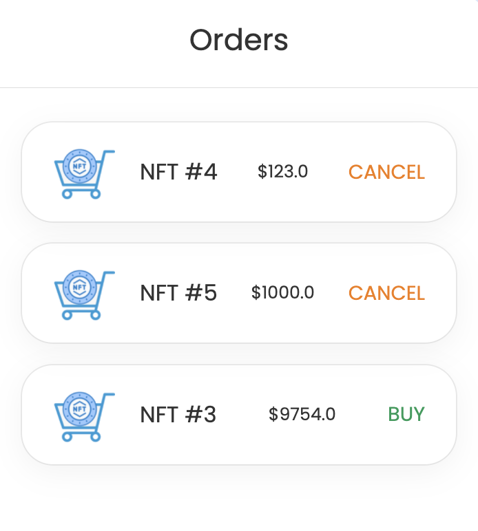

# Stable price NFT marketplace (powered by RedStone oracles)

This is an example implementation of a dApp - NFT marketplace with stable price.
TODO: add much more about the idea


## How to use the app

### Deployed version
The app is already deployed on Avalanche FUJI testnet. You can check it at: https://stable-marketplace.redstone.finance/

### Build the app
You can also clone this repo and build the app locally. Please follow the steps below:

#### 1. Clone this repo
```sh
git clone https://github.com/redstone-finance/stable-price-marketplace
cd stable-price-marketplace
```

#### 2. Install dependencies
```sh
yarn install
```

#### 3. Run local blockchain node (using hardhat)
```sh
yarn run-local-node
```

#### 4. Deploy contracts on local blockchain
```sh
yarn deploy-contracts:local
```

#### 5. Run react app
```sh
yarn app:start
```

The app should be running on http://localhost:3000

#### 6. Congifure metamask

##### 6.1 Add local hardhat network to metamask
Select `Networks dropdown` -> `Add network` and enter the following details:
**Network Name**|**hardhat-local**
:-----:|:-----:
New RPC URL|http://localhost:8545
Chain ID|31337
Currency Symbol|AVAX

Then hit the `Save` button.

##### 6.2 Add local wallets to metamask
- `User 1`: `0xac0974bec39a17e36ba4a6b4d238ff944bacb478cbed5efcae784d7bf4f2ff80`
- `User 2`: `0x59c6995e998f97a5a0044966f0945389dc9e86dae88c7a8412f4603b6b78690d`

You can see more keys in your console below the `yarn run-local-node`

#### 7. Explore the app in browser


##### Mint NFTs
After visiting the app first time you will see an almost empty screen with the `+ Mint new NFT` link. Click this link to mint new NFTs. After the minting transaction confirmation you will see your NFT in the left column.


##### Post sell orders
Once you mint any NFTs, you can post sell order for each one of them. Click the SELL button and provide the USD value. You will be asked to confirm 2 transactions: for NFT transfer approval, and for the marketplace order creation. After their confirmation, you will see your order in the Orders column.



##### Buy NFTs
You can also switch metamask account and buy the NFT. I would recommend to open the developer tools in browser at the network tab and explore network requests that are being sent before the buy transaction sending.

You should see at least 2 requests with the AVAX price data and crypto signatures. This data along with signatures is being attached for each contract call, that wants to process redstone oracle data.


<!-- 
## Tutorial

### 1. Init solidity project
```sh
yarn init
yarn add hardhat --dev
npx harhat
```

### 2. Implement NFT and marketplace contracts
#### Install openzeppelin module
TODO: describe shortly what is openzeppelin
```sh
yarn add @openzeppelin/contracts --dev
```

#### Add an example NFT contract
```js
// File: contracts/ExampleNFT.sol

// SPDX-License-Identifier: Unlicense
pragma solidity ^0.8.0;

import "hardhat/console.sol";
import "@openzeppelin/contracts/token/ERC721/ERC721.sol";

contract ExampleNFT is ERC721 {
    constructor() ERC721("ExampleNFT", "ENFT") {}
}
```

#### Implement marketplace contract
```js
```

### 3. Create tests
TODO

### 4. Connect redstone oracles
#### Install `redstone-evm-connector`
TODO: add description
```sh
yarn add redstone-evm-connector
```

#### Update contracts code
TODO: decribe

#### Update JS code
TODO: decribe


## Harhat tasks

```shell
npx hardhat accounts
npx hardhat compile
npx hardhat clean
npx hardhat test
npx hardhat node
node scripts/sample-script.js
npx hardhat help
``` -->
